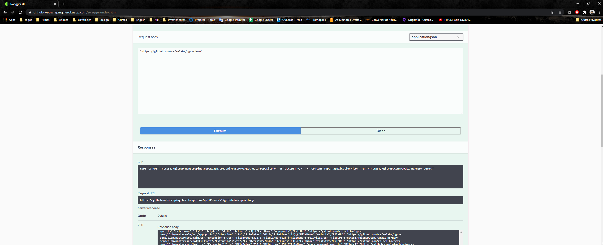
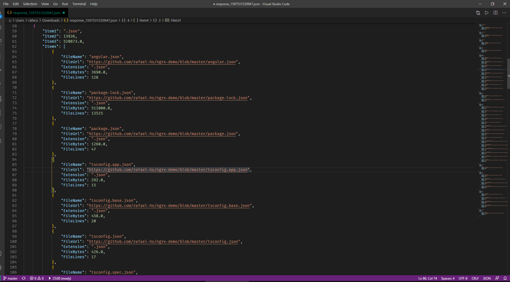

### Hi guys, my name is Rafael

##### I builded api in dotnet core and docker

I was focusing a lot on performance but it was still a little slow because of the lib I used to manipulate the html, in the end result it ended up bottlenecking the request.

##### Little repository 20 ~ 40 segs
##### Medium 50 ~ 80 segs
##### Large 3 min+

anyway this challenge was very cool
heroku link -> https://github-webscraping.herokuapp.com/swagger/index.html

Ex:

Output:

